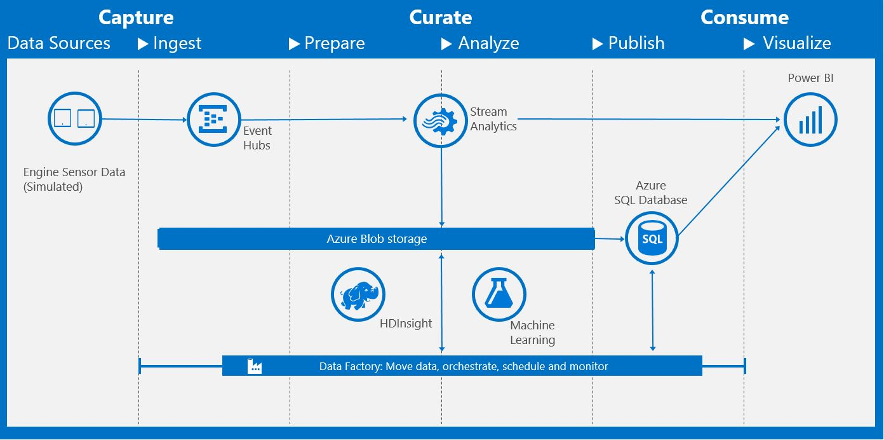

The deployment guide below provides a full set of instructions on how to put together and deploy a predictive maintenance solution using the Cortana Intelligence Suite.The **Developer Journey Map** walks through the different components created as part of the end-to-end solution. 

**For technical problems or questions about deploying this solution, please post in the issues tab of the repository.**

# Deployment Guide 

There is a lot of documentation around the Cortana Intelligence Suite Solution Template for 
predictive maintenance for aerospace that predicts the remaining useful life of an aircraft 
engine.
     
There is an overview [blog post](https://blogs.technet.microsoft.com/machinelearning/2016/02/23/predictive-maintenance-for-aerospace-a-cortana-analytics-solution-template/) and a [technical guide](https://azure.microsoft.com/en-us/documentation/articles/cortana-analytics-technical-guide-predictive-maintenance) that provide a higher level overview of the [solution template](https://gallery.cortanaintelligence.com/Solution/Predictive-Maintenance-for-Aerospace-4). 

This information is incredibly useful to understand the concepts behind and technology that 
went into creating it but does not provide the deep systems understanding that implementers 
need to understand the design in total. 

This (doc/blob/post) explains how to build the solution piece by piece and in many cases 
explains why certain decisions were made. The manual process gives an implementer an inside 
view on how the solution is built and an understanding of each of the components	.

# Requirements
This section contains required accounts and software you will need to create this solution.
1.	The full contents of the zip file.
2.	A Microsoft Azure subscription. 
3.	A Studio ML account (http://studio.azureml.net)
4.	A Microsoft Office 365 subscription for Power BI access.
5.	A network connection
6.	[SQL Server Management Studio](https://msdn.microsoft.com/en-us/library/mt238290.aspx ) or another similar tool to access a SQL server database.
7.	[Microsoft Azure Storage Explorer](http://storageexplorer.com/)
8.	[Power BI Desktop](https://powerbi.microsoft.com/en-us/desktop)
 
# Architecture
The image in this section shows the overall architecture of the Cortana Intelligence Suite 
Solution Template for predictive maintenance for aerospace that the remainder of this 
document describes in detail. 

 
The architecture is called out in the [blog post](https://blogs.technet.microsoft.com/machinelearning/2016/02/23/predictive-maintenance-for-aerospace-a-cortana-analytics-solution-template/) under the section **Solution Template Architecture**

# Setup Steps

The document walks the reader through the creation of many different Cortana Intelligence 
Suite services with the end result of replicating the architecture defined previously. 
As there are several services, it is suggested to group these services under a single [Azure 
Resource Group](https://azure.microsoft.com/en-us/documentation/articles/resource-group-overview/)

Similarly, we want to use a common name for the different services we are creating. The 
remainder of this document will use the assumption that the base service name is:

aerospacetemplate[UI][N]

Where ***[UI]*** is the users initials and ***N*** is a random integer that you choose. Characters must be 
entered in in lowercase. Several services, such as Azure Storage, require a unique name for the 
storage account across a region and hence this format should provide the user with a unique 
identifier.

So for example, Steven X. Smith might use a base service name of *aerospacetemplatesxs01*. 

## 1.	Create a new Azure Resource Group
-	Navigate to ***portal.azure.com*** and log in to your account.
-	On the left tab click ***Resource Groups***
-	In the resource groups page that appears, click ***Add***
-	Provide a name ***aerospacetemplate_resourcegroup***
-	Set the location to Central US
-	Click ***Create***

## 2.	Azure Storage Account
An ***Azure Storage*** account is used for storage of incoming aircraft sensor readings through 
***Azure Event Hub*** and ***Azure Stream Analytics***. The storage account is also used to hold HIVE 
scripts that will be executed from ***Azure Data Factory*** when processing the sensor data to pass 
into the ***Azure Machine Learning*** experiment. 

-	Navigate to ***portal.azure.com*** and login in to your account.
-	On the left tab click **New>Data and Storage>Storage Account**
-	Change the deployment model to *Classic* and click create.
-	Set the name to aerospacetemplate[UI][N]
-	Set the resource group to the resource group we created by selecting the link Choose Existing
-	Location set to South Central US
-	Click ***Create***
-	Wait for the storage account to be created.

Now that the storage account has been created we need to collect some information about it 
for other services like ***Azure Data Factory***. 

-	Navigate to ***portal.azure.com*** and login in to your account.
-	On the left tab click ***Resource Groups***
-	Click on the resource group we created earlier ***aerospacetemplate_resourcegroup*** 
-	Click on the storage account in Resources
-	In the *Settings* tab on the right click *Keys*
-	Copy the *PRIMARY CONNECTION STRING* and add it to the table below.

| Azure Storage     |  |
|-------------------|----------|
|  Storage Account  |  aerospacetemplate[UI][N]  |
|  Connection String|    |

 
### Prepare the storage account
-	Download and install the [Microsoft Azure Storage Explorer](http://storageexplorer.com/)
-	Log in to your Microsoft account associated with your Azure Subscription
-	Locate the storage account created in step 2 above and expand the nodes to see *Blob Containers*, etc.
-	Create the two containers, *maintenancesadata* and *maintenancesascript*

      1.	Right click on ***Blob Containers*** and choose ***Create Blob Container***
      1.	Enter one of the container names.
      1.	Repeat a and b until both containers are created.

-	Right click the *maintenancesascript* container and choose ***Open Blob Container Editor***
-	In the right panel, above the container listing, click the arrow on the ***Upload*** button and choose ***Upload Folder***
-	Browse to the ***Storage Files\script*** folder in the ZIP content. This will upload the required HIVE queries that will be used in data processing.

## 3.	Azure Event Hub
Azure Event Hubs is a highly scalable service that can ingest millions of records a second. This will be the ingestion point for the aircraft sensor data.
-	Navigate to ***portal.azure.com*** and login in to your account.
-	On the left tab click ***Resource Groups***
-	Click on the resource group we created earlier ***aerospacetemplate_resourcegroup*** 
-	On the resource page click ***Add***
-	On the page that appears on the right, type Event Hub in the search box. 
-	Choose ***Event Hub***
-	Click ***Create*** on the page that comes up which will re-direct you to ***manage.windowsazure.com***.
-	On the redirected page Choose ***Custom Create***
-	Enter the name aerospacetemplate[UI][N]
-	Set region to Central US
-	In the ***NAMESPACE*** drop-down menu choose ***Create new namespace***
-	The namespace will be created as aerospacetemplate[UI][N]-ns.
-	Click the next arrow, and enter *Partition Count* as 4 and *Retention Days* as 7
-	Click the check button to complete the creation

This creates the Azure Event Hub we need to receive aircraft sensor readings. The Event Hub will 
be consumed by two Azure Stream Analytics jobs. To ensure processing of the hub is successful 
we need to create [consumer groups](https://azure.microsoft.com/en-us/documentation/articles/event-hubs-programming-guide/#event-consumers) on the hub.

-	Log into ***manage.windowsazure.com***
-	In the left panel, click ***SERVICE BUS***
-	In the list, choose the namespace we created above - aerospacetemplate[UI][N]-ns
-	Click ***EVENT HUBS*** at the top of the right pane
-	The event hub we have created above (aerospacetemplate[UI][N]) should be highlighted. 
-	Click the ***CREATE CONSUMER GROUP*** at the bottom of the right pane and add  *blobcg* into the Consumer Group Name.
Repeat this but this time add *pbicg* into the Consumer Group Name.

Finally, we are going to need some information about this event hub for our event generation 
application that will feed the event hub. While still at ***manage.windowsazure.com*** 

-	Click ***SERVICE BUS*** in the left panel
-	Highlight the namespace we created above - aerospacetemplate[UI][N]-ns by clicking on the row but not the actual namespace name.
-	At the bottom of the page click ***CONNECTION INFORMATION***
-	Copy the *CONNECTION STRING* information and paste it into the table below.

The connection string and event hub name information will be needed to configure the desktop 
data generation tool that simulates aircraft sensor readings being sent to the event hub.

| Azure Event Hub     |  |
|-------------------|----------|
|  Event Hub  |  aerospacetemplate[UI][N]  |
|  Namespace |  aerospacetemplate[UI][N]-ns  |
|  Connection String |    |

### Check Event Hub
While running the demo you can validate the event hub created is receiving messages by 
following the steps below. This can be a useful debugging step to determine if the event hub is 
functioning as expected, but note that the event hub will only show activity when the data 
generation tool is executing:
-	Log in to ***manage.windowsazure.com***
-	In the menu on the left side of the screen select ***SERVICE BUS***
-	Choose the service bus created above
-	Click on *EVENT HUBS* at the top of the right hand side of the page
-	Choose the event hub created above
-	The dashboard will show, with a 15 minute latency, the activity in the event hub. You can also gain more information on the event hub by selecting ***Operation Logs*** on the dashboard page under *Management Services*.

## 4.	Azure Stream Analytics Jobs
[Azure Stream Analytics](https://azure.microsoft.com/en-us/services/stream-analytics/) allows you to create near real-time insights from devices, sensors, infrastructure and applications. For this demo Azure Stream Analytics is used to create two jobs that read sensor data from the *Azure Event Hub*.
 
The first job simply pipes all of the sensor readings into our *Azure Storage* for later processing. The second job is used to populate Power BI datasets that will be used on the dashboard. Although we have not set up *Power BI* yet, we will create both stream jobs now.

The names of the two jobs are ***maintenancesa02asablob*** and ***maintenancesa02asapbi***. For each of these two job names follow the next steps.

-	Navigate to ***portal.azure.com and login*** in to your account.
-	On the left tab click ***Resource Groups***
-	Click on the resource group we created earlier ***aerospacetemplate_resourcegroup*** 
-	On the resource page click ***Add***
-	On the page that appears on the right, type *Stream Analytics Job* in the search box. 
-	From the search results choose *Stream Analytics Job*
-	On the page that appears on the right click ***Create***
-	Enter a job name 
-	Choose the resource group created earlier ***aerospacetemplate_resourcegroup***
-	Choose the location as Central US
-	Click ***Create***

Once both jobs have been created, they can be configured. Both jobs will have the same input Event Hub, but will have different [stream queries](https://msdn.microsoft.com/en-us/library/azure/dn834998.aspx) and different outputs. 

Some of the configuration functionality for the stream analytics jobs cannot be completed at ***portal.azure.com*** so the remaining configuration steps will be on the ***manage.windowsazure.com*** site.

First we will create the inputs on the jobs. For each of the stream jobs we created at ***portal.azure.com***:

-	Navigate to ***manage.windowsazure.com*** and login in to your account (if it is already open you may need to refresh to see the streams you set up earlier).
-	On the left tab click ***STREAM ANALYTICS***
-	Click on the one of the jobs that was created in the earlier steps.
-	At the top of the right page, click ***INPUTS***
-	Click on ***ADD AN INPUT***
-	Through the set up wizard
    -	Page 1 : Choose Data Stream
	-	Page 2: Choose Event Hub
	-	Page 3:
		-	Input Alias: EventHubSource
		-	Choose the event hub we created earlier and the correct namespace.
		-	Consumer Group
			- maintenancesa02asablob uses *blobcg*
			- maintenancesa02asapbi uses *pbicg*
	-	Page 4: *EVENT SERIALIZATION FORMAT*: CSV
	-	Click the check box to complete the creation of the input.

Now we will create the queries for the jobs:

-	Navigate to ***manage.windowsazure.com*** and login in to your account.
-	On the left tab click ***STREAM ANALYTICS***
-	Click on the one of the jobs that was created in the earlier steps.
-	At the top of the right page click ***QUERY*** 
-	In the query box, copy the content of one of the scripts from the package folder ***Stream Analytics Queries***. The query files are named identically to the job name.
-	Click ***Save*** at the bottom of the page
-	Repeat for the other job.

Finally we will create the output for the jobs. The steps to creating the output is identical but the output information will be different. 

-	Navigate to ***manage.windowsazure.com*** and login in to your account.
-	On the left tab click ***STREAM ANALYTICS***
-	Click on the one of the jobs that was created in the earlier steps.
-	At the top of the right page, click ***OUTPUTS***
-	Click ***ADD AN OUTPUT***

### maintenancesa02asablob Output
-	Page 1: Choose *Blob Storage*
-	Page 2:
	-	OUTPUT ALIAS: RawDataBlobSink
	-	Choose the storage account created earlier
	-	Choose the storage container ***maintenancesadata*** that was created earlier.
	-	PATH PREFIX PATTERN: rawdata/date={date}/hour={time}
	-	Setting the prefix pattern enables the ***DATE FORMAT*** combo box. Change the format from YYYY/MM/DD to YYYY-MM-DD. This defines the format of the path 
strings in the storage account and is required for the HIVE scripts that will be executed as part of the larger data flow.
-	Page 3: EVENT SERIALIZATION FORMAT is CSV
-	Click the check button at the bottom of the wizard to add the output to the job.
-	At the bottom of the page click ***START*** to get the stream job started.

### maintenancesa02asapbi Output
There are 3 Power BI outputs that need to be created. Each are identified in the query and they are ***Aircraftmonitor***, ***Aircraftalert***, and ***Flightsbyhour***. For each of these data sets you will add an output:

-	Page 1: Choose *Power BI PREVIEW*
-	Page 2: Click the *Authorize Now* button to link to your Office 365 subscription.
-	Page 3: For *OUTPUT ALIAS*, *DATASET NAME*, and *TABLE NAME* use one of the outputs identified in the query for all three fields, for example Aircraftmonitor
-	Click the check button at the bottom of the page to accept the new output.

### Check Stream Jobs
While running the demo you can validate the stream jobs are operating as expected by 
following the steps below. Please note that the event hub will only show activity when the data 
generation tool is executing:

-	Log in to ***manage.windowsazure.com***
-	In the menu on the left side of the screen select ***STREAM ANALYTICS***
-	Choose one of the stream jobs created above
-	Click on *DASHBOARD* at the top of the right hand side of the page
-	The dashboard will show, with a 15 minute latency, the activity in the event hub. You can 
also gain more information on the event hub by selecting ***Operation Logs*** on the dashboard page under Management Services.

## 5.	Configure desktop application and test Event Hub / Stream Analytics
Now that we have the event hub and stream analytics configured we can configure the event generator and test that the flow to this point is working. 

-	Navigate to the hard disk location where the project was unzipped.
-	Go into the ***Predictive Maintenance Data Generator*** directory and start the *Generator.exe* application.
-	In the left side of the application enter the event hub name and the event hub connection string that was collected earlier.
-	Click the ***Save Configuration Changes*** button.
-	Click the green ***Start*** button.
-	The status area will change to green with the text *Running*
-	In the Events section at the top of the right hand side of the application you will see the count start to increment.

### Validating initial data generation
Leaving the generator running for about 15 minutes, we can validate that the services thus far are operating as expected. 

First validate event hub by following the steps in [help](#internaldoc) Check Event Hub. 

Next, validate that the stream analytics job related to storage is working by following the steps in [help](#internaldoc)Check Stream Jobs for the [help](#internaldoc) maintenancesa02asablob Output job. 

Finally, validate that the files are being created in the storage account by following these steps:

-	Open the Microsoft Azure Storage Explorer
-	Navigate to the storage account set up previously
-	Open the blob container maintenancesadata
-	Note that a sub folder *rawdata* has been created by the stream analytics job.

You may close the data generator as it is not required for the following steps. It will be needed later when the whole system is brought online after the remaining services have been configured.

## 6.	Azure SQL Server and Database
Now that we have completed the ingestion path, we can start building the data processing paths. We will use ***Azure Data Factory*** to process the data. To do so we need to set up a couple more services. First is an ***Azure SQL Database*** to hold remaining useful life predictions that are the result of running the ***Azure Machine Learning*** experiment. 

-	Navigate to ***portal.azure.com*** and login in to your account.
-	On the left tab click ***New>Data and Storage>SQL Database***
-	Enter the name ***pmaintenancedb*** for the database name
-	Under Server click the arrow and choose ***Create new server***
	-	Name : aerospacetemplate[UI][N]
	-	Enter in an administrator account name and password and save it to the table below.
	-	Under ***Create V12 server (latest update)*** choose no, then choose Central US as the location to keep the resource in the same region as the rest of the services.
	-	Click OK
-	Once returned to the SQL Database tab, choose the resource group previously created ***aerospacetemplate_resourcegroup***
-	Click ***Create***
-	Wait for the database and server to be created.
-	From ***portal.azure.com*** click on ***Resource Groups***  then the group for this demo ***aerospacetemplate_resourcegroup***.
-	In the list of resources, click on the SQL Server that was just created.
-	Under ***Settings*** for the new database, click ***Firewall*** and create a rule called ***open*** with the IP range of 0.0.0.0 to 255.255.255.255. This will allow you to access the database from your desktop*. Click ***Save***. 
-	Launch ***SQL Server Management Studio***, or a similar tool, and connect to the database with the information you recorded in the table below.
	-	NOTE: The server name in most tools will require the full name:                             
aerospacetemplate[UI][N].database.windows.net,1433
	-	NOTE: Choose SQL Server Authentication
-	**THESE INSTRUCTIONS ARE FOR SSMS**
	-	Click on the ***pmaintenancedb*** that you created on the server.
	-	Click ***New Query*** at the tool bar.
	-	Copy and execute the SQL script located in the package directory ***Storage Files\script\SQL*** to create the necessary table for the machine learning 
experiment and a stored procedure that will be used by ***Azure Data Factory***

**NOTE:** This firewall rule is not recommended for production level systems but for this demo is 
acceptable. You will want to set this rule to the IP range of your secure system.

| Azure SQL Database     |  |
|-------------------|----------|
|  Server Name  |  aerospacetemplate[UI][N]  |
|  Database|  pmaintenancedb  |
|  User Name |    |
|  Password |    |

## 7.	Create Azure Studio ML Workspace and Experiment

https://gallery.cortanaintelligence.com/Experiment/bcae226bc74a4cbbb0ff700ac97448bf 

This section assumes that you have not set up any workspaces for Studio ML but that you do have an account at ***studio.azureml.net***.

The first thing we need to do is to create the workspace. A workspace is where experiments are created. It is also tied to a storage account for intermediate results during experiment processing.

-	Navigate to ***manage.windowsazure.com*** and login in to your account.
-	On the left tab click ***MACHINE LEARNING***
-	In the bottom left hand corner click ***NEW***
-	Choose *DATA SERVICES\MACHINE LEARNING\QUICK CREATE*
-	For workspace name enter *aerospacetemplate[UI][N]*
-	Location South Central US
-	Choose the storage account created earlier
-	Click on ***Create an ML Workspace***

Now that we have a workspace to work within, we can copy over the required experiment from the Gallery.

-	Navigate to ***studio.azureml.net*** and log into your account
-	Navigate to the experiment [https://gallery.cortanaintelligence.com/Experiment/bcae226bc74a4cbbb0ff700ac97448bf ](https://gallery.cortanaintelligence.com/Experiment/bcae226bc74a4cbbb0ff700ac97448bf ) 
-	Click the ***Open in Studio button***. 
-	In the dialog Copy experiment from Gallery, choose appropriate South Central US and the workspace we created earlier that you would like to copy it into. Click the ***?*** button.
-	This process may take a minute, but the experiment will open in the requested workspace.
-	Click ***RUN*** at the bottom of the page. This step will take several minutes to finish and all objects in the graph will have a check box on them to indicate they have run.
-	Click ***DEPLOY WEB SERVICE*** at the bottom of the page to create the Azure Web Service associated with the experiment. When completed the browser will redirect to the web service home page.
	-	The web service home page can also be found clicking the ***WEB SERVICES*** button on the left menu of the ***studio.azureml.net*** page once logged in. 
-	Copy the ***API key*** from the web service home page and add it to the table below as you will need this information later. 
-	Click the link ***BATCH EXECUTION*** under the ***API HELP PAGE*** section. On the BATCH EXECUTION help page, copy the Request URI under the Request section and add it to the table below as you will need this information later. Copy only the URI part https:.../jobs ignoring the URI parameters starting with ? .

| Web Service BES Details  |  |
|-------------------|----------|
|  API Key  |    |
|  Request URI*|  https:.../jobs  |

## 8.	Azure Data Factory
We have now created the necessary components to put the data pipeline together using ***Azure Data Factory***. Data factories are orchestration services that move and process data in a dependency flow pipeline.

The data factory we will use for this project will make use of an on demand ***HDInsights*** cluster to read from the raw data being streamed in through the event hub and stream analytics jobs. 

*HIVE* scripts are run against the raw data using the cluster to create the required aggregates and engineered features for the machine learning experiment and another *HIVE* script is executed to feed the machine learning experiments batch execution endpoint. 

The results of the experiment are put in another blob which is then copied to the ***Azure SQL Database***.
 
Based on the data, and the flow of data, this data factory will be scheduled to run every 3 hours. This means once the entire flow is configured and enabled results will not be present until approximately 3.5 hours later.

Now it is time to create the data factory:

-	Navigate to ***portal.azure.com*** and login in to your account.
-	On the left tab click ***New>Data and Analytics>Data Factory***
-	Name: *aerospacetemplate[UI][N]*
-	Resource Group: Choose the resource group created previously ***aerospacetemplate_resourcegroup***
-	Location: Central US
-	Click ***Create***

The data factory will take some time to create. The portal page will direct you to the factory when it has been created, or you can access it through the *Resource groups* section. 

Data factories are made up of several components. Linked services define the information for the data factory to connect to other services. Datasets are named references used for input or output from an activity. Pipelines contain one or more activities to be executed. 

The next steps for the factory are to create the different parts of the factory. The following sections walk you through the steps.

### Linked Services
For this solution we are going to need 5 linked services. For these services you will need to navigate to the package location ***Data Factory\LinkedServices*** to access the scripts. 

We will create two types of linked service Store and Compute. 

-	For the two scripts *StorageLinkedService_Store.txt* and *HDInsightStorageLinkedService_Store.txt* copy the storage account connection string from the Azure Storage Account section and add it to the scripts.
-	On ***portal.azure.com*** navigate to your data factory, which is a resource in the created resource group, and click the ***Author and Deploy*** button.
-	For each of the two modified files:
	-	At the top of the tab, click New data store/Azure storage
	-	Overwrite the content in the editor window with the file content
	-	Click Deploy
-	Open the file *AzureSqlLinkedService_Store.txt* and adjust the information in the connection string to match that of the server you created in Azure SQL Server and Database section.
-	At the top of the tab, click ***New data store/Azure SQL***
-	Overwrite the content in the editor window with the file content.
-	Click ***Deploy***

Now we have the three data store linked service created, we need to create two compute services. One for the machine learning call and one for an on demand HDInsights cluster used in the processing.

-	Open the *AzuremlBatchEndpointBatchLocation_Compute.txt* and modify the mlEndponit and API key from using the information from the experiment created in Create Azure Studio ML Workspace and Experiment section.
-	On ***portal.azure.com*** navigate to your data factory and click the ***Author and Deploy*** button.
-	At the top of the tab, click ***New compute/Azure ML***
-	Copy the contents of the edited *AzuremlBatchEndpointBatchLocation_Compute.txt* into the editor.
-	Click ***Deploy***
-	At the top of the tab, click ***New compute/On Demand HDInsight*** cluster
-	Copy the content of *HDInsightLinkedService_Compute.txt* into the editor window. 
-	Click ***Deploy***

The linked services are now complete, we will now move on to creating the data sets.

### Datasets
For this solution we are going to need 6 data sets that are of type Azure Storage blob and Azure SQL tables. Navigate to the package location ***Data Factory\Datasets*** to access the scripts. 

These scripts do not need to be modified in any way, simply copied in to the editor window, so for each file:

-	On ***portal.azure.com navigate*** to your data factory and click the ***Author and Deploy*** button.
-	At the top of the tab, click ***New dataset/Azure blob storage*** EXCEPT for the content of SQLScoredResultTable.txt which you will choose ***New dataset/Azure SQL***
-	Copy the contents of the file into the editor.
-	Click ***Deploy***

| NOTE|
|-------------------|
|  Datasets define the execution window of a pipeline. In the pipeline scripts under the availability section you will see that frequency is set to hour and interval is set to 3. This means these data sets are available every 3 hours in the pipeline activity period so the pipeline will run every third hour.  | 

### Pipelines

For this solution we are going to need 3 pipelines to process our raw data from stream analytics, send the aggregated values to the machine learning experiment, and then finally move those results to our SQL database. Navigate to the package location ***Data Factory\Pipelines*** to access the scripts.

There are just a few modifications that these scripts will require. 

First, in the *MLScoringPipeline* and *AggregateFlightInfoPipeline* files locate the text ***<accountname>*** near the top of the file and replace it with the name of the storage account created earlier in Azure Storage Account section.
 
The remaining modifications have to do with activity periods for the pipelines. An activity period describes the dates and times that the pipeline should be executed. For a detailed discussion on activity periods click [here](https://azure.microsoft.com/en-us/documentation/articles/data-factory-create-pipelines/).

At the bottom of each of the three pipeline scripts there is a section that contains the following settings:

        "start": "[Start Activity Period UTC]",
        "end": "[End Activity Period UTC]", 

These fields identify when the pipeline should be active and are in UTC time. So, if you are in EST and you want to set this active from March 11th from 12:00 PM EST to 5:00 PM EST you would modify these as follows:

        "start": "2016-03-11T12:00:00Z",
        "end": "2016-03-11T17:00:00Z", 

When the pipelines are active you will incur some expense.

For each of the scripts
-	On ***portal.azure.com*** navigate to your data factory and click the ***Author and Deploy*** button.
-	At the top of the tab, click ***More commands*** and then ***New pipeline***
-	Copy the contents of the file into the editor.
-	Click ***Deploy***

Now the data factory is in place. You can see the layout of the factory by navigating to your data factory and clicking ***Diagram***.

 

### Check Data Factory
While running the demo you can validate that the data factory is operating as expected by following the steps below:

-	Log in to ***portal.azure.com***
-	In the menu on the left side of the screen select ***Resource groups***
-	Choose the previously created resource group ***aerospacetemplate_resourcegroup***.
-	Click on the data factory that was created earlier. 
-	Click on the ***Monitor & Manage*** button and validate your credentials again if prompted.
-	If there are errors being reported, navigate back to portal.azure.com to the data factory and click on the datasets to determine where in the pipeline issues have been detected. 

##  9.	Setting Up Power BI
### Overview
This section describes how to set up Power BI dashboard to visualize
your real time data from Azure Stream Analytics (hot path), as well as
batch prediction results from Azure machine learning (cold path).

### Setup cold path dashboard
In the cold path data pipeline, the essential goal is to get the
predictive RUL (remaining useful life) of each aircraft engine once it
finishes a flight (cycle). The prediction result is updated every 3
hours for predicting the aircraft engines that have finished a flight
during the past 3 hours.

Power BI connects to an Azure SQL database as its data source, where the
prediction results are stored. Note: 1) Upon deploying your
solution, a real prediction will show up in the database within 3 hours.
The pbix file that came with the Generator download contains some seed
data so that you may create the Power BI dashboard right away. 2) In
this step, the prerequisite is to download and install the free software
[Power BI
desktop](https://powerbi.microsoft.com/documentation/powerbi-desktop-get-the-desktop/).

The following steps will guide you on how to connect the pbix file to
the SQL Database that was spun up at the time of solution deployment
containing data (*e.g.*. prediction results) for visualization.

1. Get the database credentials.
   
   You'll need **database server name, database name, user name and
   password** before moving to next steps. Here are the steps to guide
   you how to find them.
   
   * Once **'Azure SQL Database'** on your solution template diagram turns green, click it and then click **'Open'**.
   * You'll see a new browser tab/window which displays the Azure
     portal page. Click **'Resource groups'** on the left panel.
   * Select the subscription you're using for deploying the solution, and
     then select **'YourSolutionName\_ResourceGroup'**.
   * In the new pop out panel, click the   icon to access your
     database. Your database name is next to the this icon (*e.g.*, **'pmaintenancedb'**), and  the **database server name** is listed under the Server name property and should look similar to **YourSoutionName.database.windows.net**.
   * Your database **username** and **password** are the same as
     the username and password previously recorded during deployment of the solution.
2. Update the data source of the cold path report file with Power
   BI Desktop.
   
   * In the folder on your PC where you downloaded and unzipped the
     Generator file, double-click the
     **PowerBI\\PredictiveMaintenanceAerospace.pbix** file. If you see any warning messages when you open the file, ignore them. On the top of the file, click **'Edit Queries'**.
     
     
   * You'll see two tables, **RemainingUsefulLife** and **PMResult**. Select the first table and click  next to **'Source'** under
     **'APPLIED STEPS'** on the right **'Query Settings'** panel. Ignore
     any warning messages that appear.
   * In the pop out window, replace **'Server'** and **'Database'** with
     your own server and database names, and then click **'OK'**. For server
     name, make sure you specify the port 1433
     (**YourSoutionName.database.windows.net, 1433**). Leave the Database field as **pmaintenancedb**. Ignore the warning
     messages that appear on the screen.
   * In the next pop out window, you'll see two options on the left pane
     (**Windows** and **Database**). Click **'Database'**, fill in your
     **'Username'** and **'Password'** (this is the username and password
     you entered when you first deployed the solution and created an
     Azure SQL database). In ***Select which level to apply these
     settings to***, check database level option. Then click
     **'Connect'**.
   * Click on the second table **PMResult** then click 
     next to **'Source'** under
     **'APPLIED STEPS'** on the right **'Query Settings'** panel, and update
     the server and database names as in the above steps and click OK.
   * Once you're guided back to the previous page, close the window. A message will pop out - click **Apply**. Lastly, click the **Save** button to save
     the changes. Your Power BI file has now established connection to the server. If your visualizations are empty, make sure you clear the selections on the visualizations to visualize all the data by clicking the eraser icon on the upper right corner of the legends. Use the refresh button to reflect new data on the visualizations. Initially, you will only see the seed data on your visualizations as the data factory is scheduled to refresh every 3 hours. After 3 hours, you will see new predictions reflected in your visualizations when you refresh the data.
3. (Optional) Publish the cold path dashboard to [Power BI
   online](http://www.powerbi.com/). Note that this step needs a Power
   BI account (or Office 365 account).
   
   * Click **'Publish'** and few seconds later a window appears
     displaying "Publishing to Power BI Success!" with a green
     check mark. Click the link below "Open
     PredictiveMaintenanceAerospace.pbix in Power BI". To find detailed instructions, see [Publish from Power BI Desktop](https://support.powerbi.com/knowledgebase/articles/461278-publish-from-power-bi-desktop).
   * To create a new dashboard: click the **+** sign next to the
     **Dashboards** section on the left pane. Enter the name "Predictive
     Maintenance Demo" for this new dashboard.
   * Once you open the report, click  to pin all the
     visualizations to your dashboard. To find detailed instructions, see [Pin a tile to a Power BI dashboard from a report](https://support.powerbi.com/knowledgebase/articles/430323-pin-a-tile-to-a-power-bi-dashboard-from-a-report).
     Go to the dashboard page and
     adjust the size and location of your visualizations and edit their titles. To find detailed instructions on how to edit your tiles, see [Edit a tile -- resize, move, rename, pin, delete, add hyperlink](https://powerbi.microsoft.com/documentation/powerbi-service-edit-a-tile-in-a-dashboard/#rename). Here is an example dashboard with some cold path visualizations pinned to it.  Depending on how long you run your data generator, your numbers on the visualizations may be different.
      
     
      
   * To schedule refresh of the data, hover your mouse over the **PredictiveMaintenanceAerospace** dataset, click  and then choose **Schedule Refresh**.
      
     **Note:** If you see a warning massage, click **Edit Credentials** and make sure your database credentials are the same as those described in step 1.
      
     
      
   * Expand the **Schedule Refresh** section. Turn on "keep your
     data up-to-date".
      
   * Schedule the refresh based on your needs. To find more information, see
     [Data refresh in Power BI](https://support.powerbi.com/knowledgebase/articles/474669-data-refresh-in-power-bi).

### Setup hot path dashboard
The following steps will guide you how to visualize real time data
output from Stream Analytics jobs that were generated at the time of
solution deployment. A [Power BI online](http://www.powerbi.com/)
account is required to perform the following steps. If you don't have an
account, you can [create one](https://powerbi.microsoft.com/pricing).

1. Add Power BI output in Azure Stream Analytics (ASA).
   
   * You will need to follow the instructions in
     [Azure Stream Analytics & Power BI: A real-time analytics dashboard for real-time visibility of streaming data](../stream-analytics/stream-analytics-power-bi-dashboard.md)
     to set up the output of your Azure Stream Analytics job as your Power BI dashboard.
   * The ASA query has three outputs which are **aircraftmonitor**, **aircraftalert**, and **flightsbyhour**. You can view the query by clicking on query tab. Corresponding to each of these tables, you will need to add an output to ASA. When you add the first output (*e.g.* **aircraftmonitor**) make sure the **Output Alias**, **Dataset Name** and **Table Name** are the same (**aircraftmonitor**). Repeat the steps to add outputs for **aircraftalert**, and **flightsbyhour**. Once you have added all three output tables and started the ASA job, you should get a confirmation message (*e.g.*, "Starting Stream Analytics job maintenancesa02asapbi succeeded").
2. Log in to [Power BI online](http://www.powerbi.com)
   
   * On the left panel Datasets section in My Workspace, the
     ***DATASET*** names **aircraftmonitor**, **aircraftalert**, and
     **flightsbyhour** should appear.This is the streaming data you pushed from Azure Stream Analytics in the previous step.The dataset **flightsbyhour** may not show up at the same time as the other two datasets due to the nature of the SQL query behind it. However, it should show up after an hour.
   * Make sure the ***Visualizations*** pane is open and is shown on the
     right side of the screen.
3. Once you have the data flowing into Power BI, you can start visualizing the streaming data.  You can create other dashboard tiles based on appropriate datasets. Depending on how long you run your data generator, your numbers on the visualizations may be different.

4. Here are some steps to create another tile –  the "Fleet View of Sensor 11 vs. Threshold 48.26" tile:
   
   * Click dataset **aircraftmonitor** on the left panel
     Datasets section.
   * Click the **Line Chart** icon.
   * Click **Processed** in the **Fields** pane so that it shows under
     "Axis" in the **Visualizations** pane.
   * Click "s11" and "s11\_alert" so that they both appear
     under "Values". Click the small arrow next to **s11** and
     **s11\_alert**, change "Sum" to "Average".
   * Click **SAVE** on the top and name the report "aircraftmonitor". The
     report named "aircraftmonitor" will be shown in the **Reports**
     section in the **Navigator** pane on the left.
   * Click the **Pin Visual** icon on the top right corner of this
     line chart. A "Pin to Dashboard" window may show up for you to
     choose a dashboard. Select "Predictive Maintenance Demo", then
     click "Pin".
   * Hover the mouse over this tile on the dashboard, click the "edit"
     icon on the top right corner to change its title to "Fleet View of
     Sensor 11 vs. Threshold 48.26" and subtitle to "Average across fleet
     over time".

## 10.	Getting it all running

All of the components and services that are needed for the demo are now in place. It is time to start up the system to have the data flow through the services and produce results for the Power BI dashboard. 

This takes a little time for the data to seed the blob storage, and the data factory, as noted, is scheduled to run every three hours. 

This setup will also take care to limit the amount of time that the demo will run, and consequently, reduce the cost to your subscription. It is up to the reader to determine if they want the system to run longer.

### Data Generator
Navigate to the package directory Predictive Maintenance Data Generator and start the Generator.exe application. From previous steps in this document the application should already be configured to send messages to the event hub. Click the Start button to start feeding events to the event hub.

|TIP|
|---|
|The data generator will only run when your laptop is on and has a network connection. It is possible when your laptop goes into "sleep" mode that the generator will stop running. To run this generator over a longer period of time it should be moved to an Azure Virtual Machine and executed there.| 

### Stream Analytics
The next thing to start is the stream analytics jobs.
-	Navigate to ***portal.azure.com*** and login in to your account.
-	On the left tab click ***Resource groups***
-	Click the resource group created earlier ***aerospacetemplate_resourcegroup***
-	Click on each stream analytics job and on the pane that appears, click the ***Start*** button at the top of the page.

### Data Factory

The final step is to set an appropriate activity period for the data factory pipelines. This is simply to update the start and end timestamps for each pipeline as discussed in the Pipelines section.

-	Navigate to ***portal.azure.com*** and login in to your account.
-	On the left tab click ***Resource groups***
-	Click the resource group created earlier ***aerospacetemplate_resourcegroup***
-	Click on the data factory in the resource group
-	Click ***Author and deploy***
-	Expand the *Pipelines* node
-	Modify each start and end with a time stamp starting at the current time and the end time for 6 hours later. 
-	Click ***Deploy***

Again, the activity period indicates how long the data factory will be in service. Limiting the number above to 6 hours will limit the expense to your subscription. However, is you do plan on deploying the generator to an Azure Virtual Machine to have a longer running demo, then adjust the activity period length accordingly. 

### Validation and Results

The Power BI dashboard initially has 12 values associated with it. These were placed into the database when we ran the script. Results from the pipeline will start to appear in just over 3 hours after starting the system up. You can ensure that the system is functioning as expected by verifying there are more results in the database table. 

However, if the table is not receiving results in approximately 3.5 hours after starting the services you can take the following steps to see where the issue might be, but also consider that the dashboards for the services update about every 15 minutes.

1.	Log into ***manage.windowsazure.com***
2.	Navigate to the event hub that was created and verify that it is receiving messages by viewing the dashboard.
3.	Navigate to the stream analytics jobs that were created and verify that it is processing messages by viewing the dashboard.
4.	Log into ***portal.azure.com***
5.	Navigate to the event hub created
6.	Navigate into the Datasets of the event hub and for each dataset view the Recently updated slices

In the case of steps 2 and 3 above, you look into the operations logs for those services to 
determine what errors, if any. 

For case 6 it is expected that the first run of the pipeline will produce an error as there is no data 
to process when it is initially started. Later runs should run successfully and if not details of the 
failure can be determined by digging into the failed time slice.
 
