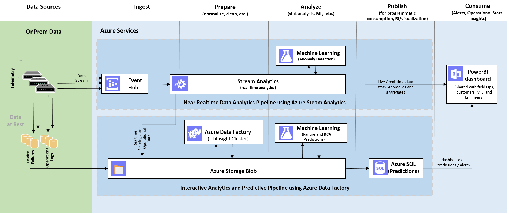

# Predictive Maintenance for Aerospace Using Cortana Intelligence Suite: Technical Guide for Manual Deployment

# Table of Contents

## [Scope](#scope-1)
## [Pre-Requisites](#pre-requisites-1)
## [Architecture](#architecture-1)
## [Solution Setup](#solution-setup)
#### [Section 1: Create a new Azure Resource Group](#section-1--create-a-new-azure-resource-group)
#### [Section 2: Deploy Azure Storage Account](#section-2-deploy-azure-storage-account-1)
#### [Section 3: Deploy Azure Event Hub](#section-3-deploy-azure-event-hub-1)
#### [Section 4: Deploy Azure Stream Analytics Jobs](#section-4-deploy-azure-stream-analytics-jobs-1)
#### [Section 5: Run Application to Generate Data](#section-5-run-application-to-generate-data-1)
#### [Section 6: Validate the Data Generation Path](#section-6-validate-the-data-generation-path-1)
#### [Section 7: Deploy Azure SQL Server and Database](#section-7-deploy-azure-sql-server-and-database-1)
#### [Section 8: Deploy Azure Studio ML Workspace and Experiment](#section-8-deploy-azure-studio-ml-workspace-and-experiment-1)
#### [Section 9: Deploy Azure Data Factory](#section-9-deploy-azure-data-factory-1)
#### [Section 10: Configure Power BI for Visualization](#section-10-configure-power-bi-for-visualization-1)
## [Execute Solution and Validate](#execute-solution-and-validate-1)
## [Completion and Clean up](#completion-and-clean-up-1)

# Scope

There are multiple documents on predictive maintenance for aerospace using Cortana Intelligence Suite Solution Template that monitors and predicts the remaining useful life (RUL) of an aircraft engine.

There is an overview [blog post](https://blogs.technet.microsoft.com/machinelearning/2016/02/23/predictive-maintenance-for-aerospace-a-cortana-analytics-solution-template/) and a [technical guide](https://azure.microsoft.com/en-us/documentation/articles/cortana-analytics-technical-guide-predictive-maintenance) that provide a higher level overview of the [solution template](https://gallery.cortanaintelligence.com/Solution/Predictive-Maintenance-for-Aerospace-4).

The [one-click solution deployment template](https://gallery.cortanaintelligence.com/Solution/Predictive-Maintenance-for-Aerospace-4) is useful to understand the concepts behind and technology that went into creating this solution. However, it does not provide the deep systems understanding that implementers need to understand the design in total.

This technical deployment guide explains how to build the solution piece by piece and in many cases, explains why certain decisions were made. The manual process gives an implementer an inside view on how the solution is built and an understanding of each of the components.

It provides a full set of instructions on how to put together and deploy a predictive maintenance solution using the Cortana Intelligence Suite. The **Developer Journey Map** walks through the different components created as part of the end-to-end solution.

**For technical problems or questions about deploying this solution, please post in the issues tab of the** [repository](https://github.com/Azure/cortana-intelligence-predictive-maintenance-aerospace) **.**

# Pre-Requisites

To implement this demo, you need an active Microsoft Azure subscription [insert link to get subscription].

Following are a list of accounts and software you will need to create this solution.

Following are a list of accounts and software you will need to create this solution.

1. [The full contents of Github file repository](https://github.com/Azure/cortana-intelligence-predictive-maintenance-aerospace) (download the zipped file).
2. [A Studio ML account](http://studio.azureml.net)
3. A [Microsoft Office 365 subscription](https://login.live.com/) for Power BI access.
4. [SQL Server Management Studio](https://msdn.microsoft.com/en-us/library/mt238290.aspx) or a similar tool to access a SQL server database.
5. [Microsoft Azure Storage Explorer](http://storageexplorer.com/)
6. [Power BI Desktop](https://powerbi.microsoft.com/en-us/desktop)
7. Internet Access

# Architecture

This predictive maintenance solution monitors aircraft and predicts the remaining useful life of aircraft engine components, based on publicly available data. It is an end-to-end solution that brings together several Azure services involving data ingestion, data storage, data processing and advanced analytics — all essential for building a predictive maintenance solution.

The solution architecture is shown in Figure 1.

 

  **Figure 1: Architecture diagram for predictive maintenance solution for aerospace**

Following is a brief explanation of each component of the solution architecture and the overall workflow:

1. The solution repository provides you a data generator as **data source.** This data source is comprised of or derived from publicly available data from the NASA data repository using the Turbofan Engine Degradation Simulation Data Set. You can run it from your desktop or install in a virtual machine in your Azure account.
2. This synthetic data feeds into the **Azure Event Hubs** service as data points.
3. _Stream Analytics_ provides real-time insights on engine health and stores that data in long-term storage for more complex, compute-intensive batch analytics. In this template, two **Azure Stream Analytics** jobs analyze the data to provide near real-time analytics on the input stream from the event hub. One of the Stream Analytics jobs archives all raw incoming events to the **Azure Storage** service for later processing by the **Azure Data Factory** service, and the other publishes results onto a **Power BI** dashboard.
4. The **HDInsight** service is used to run Hive scripts (orchestrated by **Azure Data Factory** ) to provide aggregations at scale on the raw sensor data stored in Azure Storage by the Stream Analytics job.
5. The Azure **Machine Learning** service is used (orchestrated by **Azure Data Factory** ) to make predictions on the remaining useful life (RUL) of particular aircraft engine based on the inputs received from the **HDInsight**
6. **Azure SQL Database** is used (managed by **Azure Data Factory** ) to store the prediction results received from the **Azure Machine Learning** service. These results are then consumed in the **Power BI** dashboard. A stored procedure is deployed in the SQL Database and later invoked in Azure Data Factory pipeline to store the ML prediction results into the scoring result table.
7. **Azure Data Factory** handles orchestration, scheduling, and monitoring of the batch processing pipeline.
8. Finally, **Power BI** is used for results visualization. A _Power BI_ dashboard can be built on top of the pipeline such that aircraft technicians can monitor the sensor data from an airplane or across the fleet in real time and use visualizations to schedule engine maintenance.

While this solution is customized for aircraft monitoring, it can easily be generalized for other predictive maintenance scenarios.

#

# Solution Setup

Unless otherwise stated, to setup this solution provision **all Azure services from** [http://portal.azure.com/](http://portal.azure.com/) referred henceforth as **Azure portal**.

Several services, such as Azure Storage, require a unique name for the storage account across a region. Hence to give you a unique identifier, we will use the following naming convention for this solution.

**aerodemo[UI][N]**

Characters must be entered in lowercase. For example, user Robert Smith will name Azure services he creates as _aerodemors05_

In this guide, for the sake of simplicity we&#39;ll use _aerodemo1_ as the placeholder name for all services.

Now we will walk through the actual provisioning steps.

### **Section 1:**  **Create a new Azure Resource Group**

 As there are several services, it is suggested to group these services under a single [Azure Resource Group](https://azure.microsoft.com/en-us/documentation/articles/resource-group-overview/). A resource group is a container that holds related resources for an Azure solution.

| Add a new resource group | In Azure Portal&#39;s left panel, click on Resource groups icon . In resource group blade, click on &quot;Add&quot;. |
| --- | --- |
| Set parameter values | In the form, enter these values **Name:** aerodemo1 **Subscription:** &lt;your Azure subscription name&gt; **Location:** Central US |
| Provision | Click the &quot;Create&quot; button. |

### **Section 2: Deploy Azure Storage Account**

An Azure Storage account is used for storage of incoming aircraft sensor readings through Azure Event Hub and Azure Stream Analytics. The storage account is also used to hold HIVE scripts that will be executed from Azure Data Factory when processing the sensor data to pass into the Azure Machine Learning experiment.

 

| Add a new Azure Storage account | In Azure Portal, Click on &quot;+&quot; &gt; &quot;Storage&quot; &gt; &quot;Storage Account (blob, file, table square)&quot; |
| --- | --- |
| Set parameter values | In the form, enter these values **Name:** aerodemo1 **Performance:** Standard **Replication:** Location Replication Strategy (LRS) **Subscription:** &lt;your Azure subscription name&gt; **Resource group:** Choose &quot;Use Existing&quot;; specify aerodemo1 **Location:** Central USFor all other parameters use default selections.  |
| Provision | Click the &quot;Create&quot; button. It takes few minutes to create the storage account |

 

Now that the storage account has been created we need to collect some information about it to be used by other services like the Azure Data Factory.

To retrieve the primary connection string for the Storage account, in the storage account aerodemo1 blade, select &quot;Settings&quot; &gt; Access Keys &gt; Click on the copy button next to &quot;Primary Connection String&quot;.

Record it in table 1 below for future reference.

**Table 1: Azure Storage Account**

| **Storage Account Name** | **Primary Connection String** |
| --- | --- |
| aerodemo1 | &lt;copied connection string value&gt; |

#### **Add Blob Containers**

**Pre-requisites:**

1. To explore data in Azure storage, download and install the [Microsoft Azure Storage Explorer](http://storageexplorer.com/) (or any similar tool)
2. From Azure Github, download and save the zipped repository or clone it to your local computer. NOTE: The zipped folder name is very long. To avoid errors due to long path name, either rename the folder before you unzip or save it to a folder which has a short path (e.g. C:/Demo).

Execute below steps to add two blob containers, namely, _maintenancesadata_ and _maintenancesascript._  

| Create new Blob Container _maintenancesadata_ | In Storage account aerodemo1 blade, select &quot;Overview&quot; &gt; &quot;Blobs&quot; &gt; &quot;+&quot;. Specify blob name as _maintenancesadata._ Click on the &quot;Create&quot; button. |
| --- | --- |
| Create new Blob Container _maintenancesascript_ | In Storage account aerodemo1 blade, select &quot;Overview&quot; &gt; &quot;Blobs&quot; &gt; &quot;+&quot;. Specify blob name as _maintenancesascript._ Click on the &quot;Create&quot; button. |
| Upload HIVE queries for data processing | **1.** Click on the _maintenancesascript_ container. This will bring up a panel on the right. Click the &quot;Upload&quot; button.   **2.** Browse to the &quot;Storage Files\script&quot; folder in the repository you downloaded. This will upload the required HIVE queries that will be used in data processing later in this deployment.

### **Section 3: Deploy Azure Event Hub**

Azure Event Hubs is a highly scalable service that can ingest millions of records per second. In this solution, the event hub will be the ingestion point for the aircraft sensor data.

| Add Azure Event Hub Namespace | In Azure Portal, click on &quot;+ New&quot; &gt; &quot;Internet of Things&quot; &gt; &quot;Event hub&quot; &gt; &quot;Create&quot;. |
| --- | --- |
| Set parameter values | In the form, enter these values **Name:** aerodemo1 **Subscription:** &lt;your Azure subscription name&gt; **Resource group:** Choose &quot;Use Existing&quot;; specify aerodemo1 **Location:** Central US  |
| Provision Azure Event Hub Namespace | Click the &quot;Create&quot; button. Note: This will create the Event hub namespace. In the top panel of this panel click on &quot;+Event hub&quot; to provision a new event hub.   |
| Set Event hub parameter values | **Name:** aerodemo1\_EHFor all other parameters use default value selections.    |
| Provision Azure Event Hub | Click the &quot;Create&quot; button.   |

This creates the Azure Event Hub we need to receive aircraft sensor readings. The Event Hub will be consumed by two Azure Stream Analytics jobs. To ensure processing of the hub is successful we need to create [consumer groups](https://azure.microsoft.com/en-us/documentation/articles/event-hubs-programming-guide/#event-consumers) on the hub.

| Create Consumer Group | Click event hubaerodemo1\_EH &gt; In the menu panel select &quot;Consumer Group&quot; under Entities.Click &quot;+Consumer Group&quot; to add new consumer group, provide name: blobcg_._Repeat above step to add consumer group, name: pbicg  |
| --- | --- |

 

The connection string and event hub name information will be needed to configure the desktop data generation tool that simulates aircraft sensor readings being sent to the event hub.

 

| Get Connection String for Event hub namespace | **1.** In Event hub namespace &quot;aerodemo1&quot;, select &quot;Overview&quot; &gt; &quot;Connection Strings&quot;. **2.** This brings up the shared access policy window. Click policy &quot;RootManageSharedAccessKey&quot;, and copy the &quot;Connection string–primary key&quot; value. **3.** Record the connection string value in table 2: Azure Event Hub.
| --- | --- |

**Table 2: Azure Event Hub**

| **Azure Event Hub Namespace** | **Primary Connection String** |
| --- | --- |
|  | |

### **Section 4: Deploy Azure Stream Analytics Jobs**

[Azure Stream Analytics](https://azure.microsoft.com/en-us/services/stream-analytics/) (ASA) allows you to create near real-time insights from devices, sensors, infrastructure and applications. For this solution, we will deploy two Azure Stream Analytics jobs, namely, **maintenancesa02asablob** and **maintenancesa02asapbi,** to read sensor data from the Azure Event Hub.

**maintenancesa02asablob** simply pipes all the sensor readings into our Azure Storage for later processing.

**maintenancesa02asapbi** populates Power BI datasets that will be used on the dashboard. Although we have not set up Power BI yet, we will create both stream jobs now.

| Add Azure Stream Analytics (ASA) jobs | In Azure Portal, click on &quot;+ New&quot; &gt; &quot;Data + Analytics&quot; &gt; &quot;Stream Analytics job&quot;. |
| --- | --- |
| Set parameter values | In the form, enter these values **Name:** maintenancesa02asablob **Subscription:** &lt;your Azure subscription name&gt; **Resource group:** Choose &quot;Use Existing&quot;; specify aerodemo1 **Location:** Central US  |
| Provision ASA jobs | Click the &quot;Create&quot; button. **NOTE:** This will create stream analytics job maintenancesa02asablob.Repeat above steps to create stream the second job maintenancesa02asapbi.  |

 

For each job, we need to configure their respective input, query and output. Configure both jobs with input as same Event hub to receive the sensor data, but with different queries and outputs as shown in the table below.

 

| Add Input for (ASA) job | In the ASA blade for maintenancesa02asablob job, select &quot;Job Topology&quot; &gt; &quot;Input&quot; &gt; &quot;+Add&quot; |
| --- | --- |
| Set parameter values | In the form, enter these values **Import option:** Provide event hub settings manually **Service bus namespace:** &lt;name of event hub namespace e.g. aerodemo1&gt; **Event hub name:** &lt;name of the event hub e.g. aerodemo1\_EH&gt; **Event hub policy name:** RootManageSharedAccessKey **Event hub policy key:** &lt;insert the key you copied in Step-3&gt; **Event hub consumer group:** blobcgClick &quot;Create&quot; button to provision the input. **NOTE:** Repeat above steps to create input for the second job maintenancesa02asapbi, using identical parameter values, **except** for &quot;Event hub consumer group&quot; enter value as &quot;pbicg&quot;   |

 

| Add Query for (ASA) job | In the ASA blade for maintenancesa02asablob job, select &quot;Job Topology&quot; &gt; &quot;Query&quot; &gt; &quot;+Add&quot; |
| --- | --- |
| Configure Query | In the query editor box, insert the contents of the file named as &quot;maintenancesa02asablob&quot; in the **Stream Analytics Queries** folder in the repository you downloaded in Step-2. **NOTE:** Repeat above steps to create query for the second job maintenancesa02asapbi. |

 

| Add Output for (ASA) job maintenancesa02asablob | In maintenancesa02asablob blade, select &quot;Job Topology&quot; &gt; &quot;Output&quot; &gt; &quot;+Add&quot; |
| --- | --- |
| Set parameter values | In the form, enter these values **Output Alias:** RawDataBlobSink **Import option:** Provide blob storage settings manually **Storage account:** &lt;name of storage e.g. aerodemo1&gt; **Storage account key:** &lt;insert the key you copied in Step-2&gt; **Container:** maintenancesadata **Path pattern:** rawdata/date={date}/hour={time} **Date format:** YYYY-MM-DD_[This defines the format of the path strings in the storage account and is required for the HIVE scripts that will be executed as part of the larger data flow.]_ **Time format:** HH  |

Next, configure three outputs, namely, &quot;Aircraftmonitor&quot;, &quot;Aircraftalert&quot;, and &quot;Flightsbyhour&quot; against the maintenancesa02asapbi ASA job.

 

| Add Output for (ASA) job maintenancesa02asapbi | In maintenancesa02asapbi blade, select &quot;Job Topology&quot; &gt; &quot;Output&quot; &gt; &quot;+Add&quot; |
| --- | --- |
| Set parameter values | In the form for each output, enter the values as shown below: **NOTE:** In the steps below replace &lt;value&gt; with the three output names &quot;Aircraftmonitor&quot;, &quot;Aircraftalert&quot;, and &quot;Flightsbyhour&quot;, as you repeat these steps three times.  **Output Alias:** &lt;value&gt; **Sink:** Power BI Click the _Authorize_ button to link to your Office 365 subscription.  **DataSet Name:** &lt;value&gt; **Table Name:** &lt;value&gt; Click on &#39;Create&#39; button to create the new output.  |

### **Section 5: Run Application to Generate Data**

In this solution, the event hub received data from a simulator that streams simulated aircraft engine data.

Now that we have the event hub and stream analytics configured we can configure the data generator.

| Launch application | In the repository, you downloaded in Step 2, open the &quot;Predictive Maintenance Data Generator&quot; folder Start the application &quot;Generator&quot;  |
| --- | --- |
| Configure application | In the Generator user interface, configure **EventHubName** : &lt;event hub name, e.g.  aerodemo1\_EH&gt; **EventHubConnectionString:** &lt;insert the key you copied in Step-3&gt; Click on &quot;Save Configuration Changes&quot; button to save the config.  |
| Start application | Click on the green &quot;Start&quot; button to start data generation.The status button will change to green and display the text &quot; **Running&quot;** and the **&quot;Events&quot;** counter next to the button will start to increment. |

**NOTE:**  Data generator can also be run in the cloud, using an Azure  [Virtual Machine](https://docs.microsoft.com/en-us/azure/virtual-machines/virtual-machines-windows-hero-tutorial).

### **Section 6: Validate the Data Generation Path**

The Event hub and the ASA jobs receives data generated by the data generator. So, both the Event Hub and ASA will be now checked to validate the data generation path.

**Validate Event Hub**

|  |
| --- |
|1. In the event hub namespace aerodemo1 blade, select Overview. |
| |
| 2. The overview dashboard will show, with a 15-minute latency, the activity in the event hub. Both the graph and the table will show the event activity in terms of incoming messages, send requests etc. |

**Validate Stream Analytics Jobs**

To validate ASA jobs, you need to first start executing each of the jobs, **maintenancesa02asablob** and **maintenancesa02asapbi.**

|  |
| --- |
|1. In the blade of each ASA job, select Overview. From the menu at the top of the blade, click on &quot;Start&quot; to begin to execute the jobs. |
|  |
|2. With a 15-minute latency, both the graph and &quot;Input Event&quot; and &quot;Output Event&quot; counters in the monitoring section of the blade for each job will begin to increase. |

Finally, validate that the files are being created in the storage account by following these steps:

|  |
| --- |
|**1.** Open the Microsoft Azure Storage Explorer desktop app |
|  |
| **2.** Navigate to the storage account set up previously (aerodemo1)|
| **3.** Open the blob container &quot;maintenancesadata&quot; |
| **4.** Note that a sub folder _rawdata_ has been created by the stream analytics job. |

 

### **Section 7: Deploy Azure SQL Server and Database**

 

So far we have configured and validated the ingestion path. Next we can start building the data processing paths. In the solution Azure Data Factory is used to process the data, which requires a couple more services, namely, Azure SQL Database and Azure Machine Learning.

In this step, we will configure an Azure SQL Database to hold the remaining useful life (RUL) predictions which results from running the Azure Machine Learning experiment.

 

| Add Azure SQL Database | In Azure Portal, click on &quot;+ New&quot; &gt; &quot;Databases&quot; &gt; &quot;SQL Database&quot; &gt; &quot;Create&quot;. |
| --- | --- |
| Set parameter values | In the form, enter these values  **Database Name:** pmaintenancedb  **Subscription:** &lt;your Azure subscription name&gt;  **Resource group:** Choose &quot;Use Existing&quot;; specify aerodemo1  **Select Source:** Blank DatabaseServer: Choose &quot; Create new server&quot;. In the new server form configure:  **Server name:** aerodemo1  **Server admin login:** &lt;enter username&gt;  **Password:** &lt;enter password&gt;  **Confirm password:** &lt;re-enter password&gt;   **NOTE:** Write down the server-name, username and password as you will need to refer these later.  **Location:** Central US For all other parameters, it is okay to use the default values. |
| Provision Database | Click on &quot;Create&quot; to provision the new database. Wait till this step completes. |
| Set firewall to enable access from desktop | In the newly created database pmaintenancedb blade, select Overview &gt; &quot;Set Server Firewall&quot; (from top menu). Create a firewall name using following valuesRule name: OpenStart IP: 0.0.0.0End IP: 255.255.255.255   **NOTE:** This firewall rule is not recommended systems in production, where you want to set this rule to the IP range of your secure system. However, for this demo it is acceptable.  |
| Get database connection string | In pmaintenancedb blade, &quot;Overview&quot; &gt; &quot;Show database connection strings&quot;. Copy the ADO.NET (SQL authentication) string and store in the table below |

**NOTE:** To execute further steps, you need to install SQL Server Management Studio (SSMS) or a similar tool.

| Connect to the SQL database from your desktop | Launch SSMS (or a similar tool) in your desktop, in the dialogue box enter **Server name** : aerodemo1. database.windows.net,1433 (most tools require the full name) **Authentication:** SQL Server Authentication  |
| --- | --- |
| Create tables for ML experiment and Azure Data factory |**1.** Click on pmaintenancedb SQL Database  **2.** Click &quot;New Query&quot; in the tool bar.  **3.** From the repository that you downloaded in section-2, copy the file in Storage Files\script\SQL and Execute it here. This step will create the necessary table for the machine learning experiment and a stored procedure that will be used by Azure Data Factory.  |

 

**Table 3: Azure SQL Database Information**

| Server Name |   |
| --- | --- |
| Database |   |
| User Name |   |
| Password |   |
| Connection String |   | |
 
 
 

### **Section 8: Deploy Azure Studio ML Workspace and Experiment**

The first thing we need to do is to create the workspace. A workspace is where experiments are created. It is also tied to a storage account for intermediate results during experiment processing.
 
 
 

| Add Azure ML Workspace | In Azure Portal, click on &quot;+ New&quot; &gt; &quot;Data + Analytics&quot; &gt; &quot;Machine Learning Workspace&quot; &gt; Create |
| --- | --- |
| Set parameter values | In the form, enter these values **Workspace Name:** aerodemo1 **Subscription:** &lt;your Azure subscription name&gt; **Resource group:** Choose &quot;Use Existing&quot;; specify aerodemo1 **Location:** Central US **Storage Account:** Choose &quot;Use Existing&quot;; specify aerodemo1 **Pricing tier:** Standard **Web service plan:** Choose &quot;Create New&quot;, enter service plan name For all other parameters, it is okay to use the default values.  |
| Copy over the required experiment from the Gallery | **1.** Click [here](https://gallery.cortanaintelligence.com/Experiment/bcae226bc74a4cbbb0ff700ac97448bf) to navigate to the experiment.  **2.** Click the &quot;Open in Studio&quot; button.  **3.** After ML studio launches, in the dialog box &quot;Copy experiment from Gallery&quot;, select:  - ** ML Workspace:** aerodemo1   - ** Location:** Central US   The experiment will now be copied over to aerodemo1 workspace.   **NOTE:** This process may take a few minutes. Once copied the experiment will open in the requested workspace. If prompted for upgrade, select OK.  |
| Run ML Experiment | Click &quot;RUN&quot; at the bottom of the page. NOTE: This step will take several minutes to finish and all objects in the graph will have a check box on them to indicate they have run.  |
| Create the Azure Web Service | **1.** Click &quot;DEPLOY WEB SERVICE&quot; at the bottom of the page to create the Azure Web Service associated with the experiment. When completed the browser will redirect to the web service home page.   **2.** Copy the &quot;API key&quot; from the web service home page and record it in table 4 below as you will need this information later.   **3.** Click the link **BATCH EXECUTION** under the **API HELP PAGE** section. On the BATCH EXECUTION help page, copy the Request URI under the Request section and record it in table 4 below as you will need this information later.

 

**NOTE:** 1. Copy only the URI part &quot;https:…/jobs&quot; ignoring the URI parameters starting with &quot;?&quot;. 2. The web service home page can also be found clicking the **WEB SERVICES** button on the left menu of the **studio.azureml.net** page once logged in.

**Table 4: Azure Web Service Parameters**

| API KEY |   |
| --- | --- |
| REQUEST URI |    |

 

### **Section 9: Deploy Azure Data Factory**
 

We have now created the necessary components to put the data pipeline together using Azure Data Factory. Data factories are orchestration services that move and process data in a dependency flow pipeline.

The data factory in this solution uses an on-demand **HDInsight** cluster.  HIVE scripts run on this cluster to process raw data streamed from the event hub and ASA, to create the required aggregates and engineered features for the machine learning experiment.

Another _HIVE_ script is executed to feed the machine learning experiment&#39;s batch execution endpoint.

The results of the experiment are put in another blob which is then copied to the Azure SQL Database.

Based on the data, and the flow of data, this data factory will be scheduled to run every 3 hours. This means once the entire flow is configured and enabled, results will not be present until approximately 3.5 hours later.
 
 

| Add Azure Data Factory | In Azure Portal, click on &quot;+ New&quot; &gt; &quot;Data + Analytics&quot; &gt; &quot;Data Factory&quot;.  |
| --- | --- |
| Set parameter values | In the form, enter these values  **Name:** aerodemo1  **Subscription:** &lt;your Azure subscription name&gt;  **Resource group:** Choose &quot;Use Existing&quot;; specify aerodemo1  **Location:** Central US   |
| Provision | Click &quot;Create&quot;. Wait till the data factory is deployed, it may take several minutes.  |

Next, we will configure the various data factory components which will be used in this solution.

**Linked services** define the information for the data factory needed to connect to other services.

**Datasets** are named references used for input or output from an activity.

**Pipelines** contain one or more activities to be executed.

#### **Deploy Linked Services**
 
In this solution, we will deploy 5 linked services using scripts already included in the repository you downloaded in step 2.

We will create two types of linked service Store and Compute.

| Edit scripts for Azure Storage linked services | Replace the Connection String value in the two files &quot;StorageLinkedService\_Store.txt&quot; and &quot;HDInsightStorageLinkedService\_Store.txt&quot; with the connection string of the storage account aerodemo1 (created in Step 2). |
| --- | --- |
| Deploy Azure Store linked services | In Azure data factory aerodemo1 blade, &quot;Author and Deploy&quot; &gt; &quot;New data store&quot; &gt; &quot;Azure storage&quot; will open a draft file. In the editor overwrite the content of the file with that of StorageLinkedService\_Store.txt. Click &quot;Deploy&quot;, wait for deployment to complete.Repeat above step for HDInsightStorageLinkedService\_Store.txt  |
| Edit scripts for Azure SQL linked services | Replace the Connection String value in the file AzureSqlLinkedService\_Store.txt.with the connection string of the SQL database pmaintenancedb (refer table in Step 6). |
| Deploy Azure SQL linked services | In Azure data factory aerodemo1 blade, &quot;Author and Deploy&quot; &gt; &quot;New data store&quot; &gt; &quot;Azure SQL&quot; will open a draft file. In the editor overwrite the content of the file with that of AzureSqlLinkedService\_Store.txt. Click &quot;Deploy&quot;, wait for deployment to complete.  |
| Edit scripts for Azure Compute linked services for machine learning call | Replace the values in mlEndpoint and APLI key in the file AzuremlBatchEndpointBatchLocation\_Compute.txtwith Request URI and API Key values from the ML experiment (refer table in Step 7). |
| Deploy Azure Compute linked services for machine learning call | In Azure data factory aerodemo1 blade, &quot;Author and Deploy&quot; &gt; &quot;New Compute&quot; &gt; &quot;Azure ML&quot; will open a draft file. In the file editor overwrite the content of the file with that of AzuremlBatchEndpointBatchLocation\_Compute.txt. Click &quot;Deploy&quot;, wait for deployment to complete.  |
| Deploy Azure Compute linked services for on-demand HDInsight cluster | In Azure data factory aerodemo1 blade, &quot;Author and Deploy&quot; &gt; &quot;New Compute&quot; &gt; &quot;HDInsight Cluster&quot; will open a draft file. In the file editor overwrite the content of the file with that of HDInsightLinkedService\_Compute.txt. Click &quot;Deploy&quot;, wait for deployment to complete.  |

The linked services are now complete; we will now move on to creating the data sets.

**TIP:** HDInsight clusters request a certain number of resources from your subscription. It is possible that your subscription may be out of resources, or enough resources (cores) required for this data factory. If you have reached the limit for the region chosen for this deployment you can use the following steps to help resolve this:
  - Create a new resource group in another region
  - Follow the steps above to create the Azure Data Factory in that region.

#### **Deploy Datasets**

 

For this solution, we are going to need 6 data sets that are of type Azure Storage blob and Azure SQL tables.

 

|  |  |
| --- | --- |
|Deploy Data Sets | In Azure data factory aerodemo1 blade, click on &quot;Author and Deploy&quot;.At the top of the tab, click &quot;New dataset/Azure blob storage&quot; EXCEPT for the content of SQLScoredResultTable.txt which you will choose &quot;New dataset/Azure SQL&quot;Copy the contents of the file into the editor. Click Deploy  |

#### **Deploy Pipelines**
 
For this solution, we are going to need 3 pipelines to process our raw data from stream analytics, send the aggregated values to the machine learning experiment, and then finally move those results to our SQL database.

There are two modifications that the files require.

1. In the MLScoringPipeline and AggregateFlightInfoPipeline files locate the text near the top of the file and replace &lt;accountname&gt; with aerodemo1 (the name of the storage account created in Step 2).
2. Edit the activity periods for the 3 pipelines. An activity period describes the dates and times that the pipeline should be executed. For a detailed discussion on activity periods click [here](https://azure.microsoft.com/en-us/documentation/articles/data-factory-create-pipelines/).

At the bottom of each of the three pipeline scripts there is a section that contains the following settings:

    "start": ""[Start Activity Period UTC]"",

    "end": ""[End Activity Period UTC]"",

These fields identify when the pipeline should be active and are in UTC time. So, if you are in EST and you want to set this active from March 11th from 12:00 PM EST to 5:00 PM EST you would modify these as follows:

    "start": "2016-03-11T12:00:00Z",

    "end": "2016-03-11T17:00:00Z",

When the pipelines are active you will incur some expense.

| Deploy Pipelines | In Azure data factory aerodemo1 blade, click on &quot;Author and Deploy&quot;.At the top of the tab, click &quot;More commands&quot; &gt; &quot;New pipeline&quot;Copy the contents of the file into the editor.Click Deploy  |
| --- | --- |

#### **Check Data Factory**
 
From the data factory blade,

1. To see the layout of the factory, click &quot;Diagram&quot; **.**
2. Click on the &quot;Monitor &amp; Manage&quot; button and validate your credentials again if prompted. If there are errors being reported, navigate back to portal.azure.com to the data factory and click on the datasets to determine where in the pipeline issues have been detected.

### **Section 10: Configure Power BI for Visualization**
 
This section describes how to set up Power BI dashboard to visualize your real-time data from Azure Stream Analytics (hot path), as well as batch prediction results from Azure machine learning (cold path).

# Pre-requisites:

1. Download and install the free software [Power BI desktop](https://powerbi.microsoft.com/documentation/powerbi-desktop-get-the-desktop/). In this solution, Power BI connects to the Azure SQL database (provisioned in Step 6) as its data source, where the prediction results are stored. You must successfully complete Step 6 to proceed in this section.
2. Access to &quot;PredictiveMaintenanceAerospace.pbix&quot; in the &quot;Power BI template&quot; directory in the downloaded repository. This file contains some seed data so that you may create the Power BI dashboard right away.
3. To setup Power BI dashboard in the hot path, you must have already completed Step 8 and successfully deployed the Datasets in Azure Data factory.

### **Setup Dashboard for Cold path**
 
In the cold path data pipeline, the essential goal is to get the predictive RUL (remaining useful life) of each aircraft engine once it finishes a flight (cycle). The prediction result is updated every 3 hours for predicting the aircraft engines that have finished a flight over the past 3 hours.

After you deploy the solution, a real prediction will show up in the database within 3 hours.

Follow the steps below to connect pbix file to the SQL Database (containing prediction results) for visualization.

1. Get the database credentials from SQL database table where you saved the values in Step 6.

You&#39;ll need database server name, database name, user name and password before moving to next steps. Update the data source of the cold path report file with Power BI Desktop.

1. Double-click the Power BI Template\PredictiveMaintenanceAerospace.pbix file. If you see any warning messages when you open the file, ignore them. On the top of the file, click &#39;Edit Queries&#39;.

 next to &#39;Source&#39; under &#39;APPLIED STEPS&#39; in &#39;Query Settings&#39; panel on the right. Ignore any warning messages that appear.
2. In the pop out window, replace &#39;Server&#39; and &#39;Database&#39; with your own server and database names, and then click &#39;OK&#39;. For server name, make sure you specify the port 1433 (database.windows.net, 1433). Leave the Database field as pmaintenancedb. Ignore the warning messages that appear on the screen.
3. In the next pop out window, you&#39;ll see two options on the left pane (Windows and Database). Click &#39;Database&#39;, fill in &#39;Username&#39; and &#39;Password&#39; for the SQL Database.

If prompted for &quot;_level to apply these settings to&quot;_, check database level option. Click &#39;Connect&#39;.

1.
7.For the second table PMResult click . In the top menu, click &#39;Publish&#39; and few seconds later a message window appears confirming &quot;Publishing to Power BI Success!&quot; with a green check mark. In the message window, click the link &quot;Open PredictiveMaintenanceAerospace.pbix in Power BI&quot;. To find detailed instructions, see [Publish from Power BI Desktop.](https://powerbi.microsoft.com/en-us/documentation/powerbi-desktop-upload-desktop-files/)

           The following steps are to be executed in Power BI online (in My workspace).

1. From the left menu panel, Click on &quot;My Workspace&quot; &gt; &quot;Reports&quot;. Select the report you just published.
2.
2.Once you open the report, click .
3. Go to the dashboard page and adjust the size and location of your visualizations and edit their titles. You can find detailed instructions on [how to edit your tiles here](https://powerbi.microsoft.com/en-us/documentation/powerbi-service-edit-a-tile-in-a-dashboard/#rename).

Below is an example dashboard with some cold path visualizations pinned to it. Depending on how long you run your data generator, your numbers on the visualizations may be different.

 and then choose Schedule Refresh.
**Note:** If you see a warning massage, click Edit Credentials and make sure your database credentials are the same as those used in Step 6 of this document.
Expand the Schedule Refresh section. Turn on &quot;keep your data up-to-date&quot;.
2. Schedule the refresh based on your needs. To find more information, see [Data refresh in Power BI](https://powerbi.microsoft.com/en-us/documentation/powerbi-refresh-data/).

1. 2. **Setup Dashboard for the Hot Path**

Pre-requisites:

- **** A [Power BI online](http://www.powerbi.com/) account is required to perform the following steps. If you don&#39;t have an account, you can [create one](https://powerbi.microsoft.com/pricing).
- **** You have already completed Step 8, Deploy Azure Stream Analytics Jobs.

Now we need to create tiles to visualize streaming data from the Stream Analytics jobs created in Step 8 of this solution deployment.

In [Power BI online](http://www.powerbi.com/), on the left panel, under &quot;My Workspace&quot; &gt; &quot;Dataset&quot;, the dataset names _aircraftmonitor_, _aircraftalert_, and _flightsbyhour_ should appear. The dataset _flightsbyhour_ may not show up at the same time as the other two datasets due to the nature of the SQL query behind it. However, it should show up after an hour.

Make sure the **Visualizations** pane is open on the right side of the screen.

When you start streaming, data using the generator, you&#39;ll see the input and output counters in ASA increment in the Azure portal dashboard. For the outputs linked to power BI, this data will stream into Power BI, and you can start visualizing the streaming data.

Depending on how long you run your data generator, your numbers on the visualizations may differ. You can create other dashboard tiles based on appropriate datasets to visualize the data.

For example, to create a tile with title &quot;Fleet View of Sensor 11 vs. Threshold 48.26&quot; follow the steps as below:

1. **1.** On the left panel Dataset section, click on aircraftmonitor.
2. **2.** Select the line chart icon in the visualization panel.
3. **3.** In the Fields pane, check the box against &quot;processed&quot;, verify it gets added under &quot;Axis&quot; in the Visualizations pane.
4. **4.** In the Fields pane, check the boxes against &quot;s11&quot; and &quot;alerts&quot; so that they both appear under &quot;Values&quot;. In the dropdown list against &quot;s11&quot; and &quot;alerts&quot;, change the selection from &quot;Sum&quot; to &quot;Average&quot;.
5. **5.** Click &quot;Save&quot; on the top menu and name the report &quot;aircraftmonitor&quot;. This report will now get listed under the Reports section in the navigator panel.
6. **6.** From the top menu, click on &quot;Pin LIVE Page&quot;. In &quot;Pin to Dashboard&quot; dialog box, either create a new dashboard or select an existing dashboard, then click &quot;Pin Live&quot;.
7. **7.** Go to the dashboard to edit the title to &quot;Fleet View of Sensor 11 vs. Threshold 48.26&quot; and subtitle to &quot;Average across fleet over time&quot;.

# Execute Solution and Validate

All the components and services that are needed for the demo are now in place. It is time to start up the system to have the data flow through the services and produce results for the Power BI dashboard.

It takes some time for the data to seed blob storage. The data factory, as noted earlier, is scheduled to run every three hours.

This solution template has showed you how to customize the duration for which this runs, and consequently limit the expense to your subscription.

## **Validate the Data Generation Path**

To validate the data generation path, start the desktop data generator application and follow **the steps in section 6** of this guide to verify that both the event hub and ASA are receiving the streaming data.

## **Validate the Data Factory**

The final step is to set an appropriate activity period for the data factory pipelines. Modify each start and end with a time stamp starting at the current time and the end time for 6 hours later.

Refer section 8 (Configuring Pipelines) to update the start and end timestamps for each pipeline.

Again, the activity period indicates how long the data factory will be in service. Limiting the number above to 6 hours will limit the expense to your subscription. However, if you do plan on deploying the generator to an Azure Virtual Machine to have a longer running demo, then adjust the activity period length accordingly.

## **Verifying Results**

The Power BI dashboard initially has 12 values associated with it. These were placed into the database when we ran the script. Results from the pipeline will start to appear in just over 3 hours after starting the system up. You can ensure that the system is functioning as expected by verifying there are more results in the database table.

However, if the table is not receiving results in approximately 3.5 hours after starting the services, you can take the following steps to see where the issue might be, but also consider that the dashboards for the services update about every 15 minutes.

1. In Azure portal, navigate to the event hub that was created and verify that it is receiving messages by viewing the dashboard.
2. Navigate to the stream analytics jobs that were created and verify that it is processing messages by viewing the dashboard.
3. Navigate to the Datasets in the data factory and for each dataset view the Recently updated slices.
4. In the case of steps 1 and 2 above, consider the operations logs for those services to determine what errors, if any.
5. For step 3, it is expected that the first run of the pipeline will produce an error as there is no data to process when it is initially started. Later runs should run successfully and if not details of the failure can be determined by digging into the failed time slice.

# Completion and Clean up

After completing the solution and evaluating the results, to avoid further billing on your subscription, we recommend that you stop the data generator, ASA jobs. Clean up any ML experiments and Azure web services from ML Studio.

Finally delete the resource group(s) you created to deploy this solution template. This will remove all Azure resources (services) provisioned under the resource groups.
